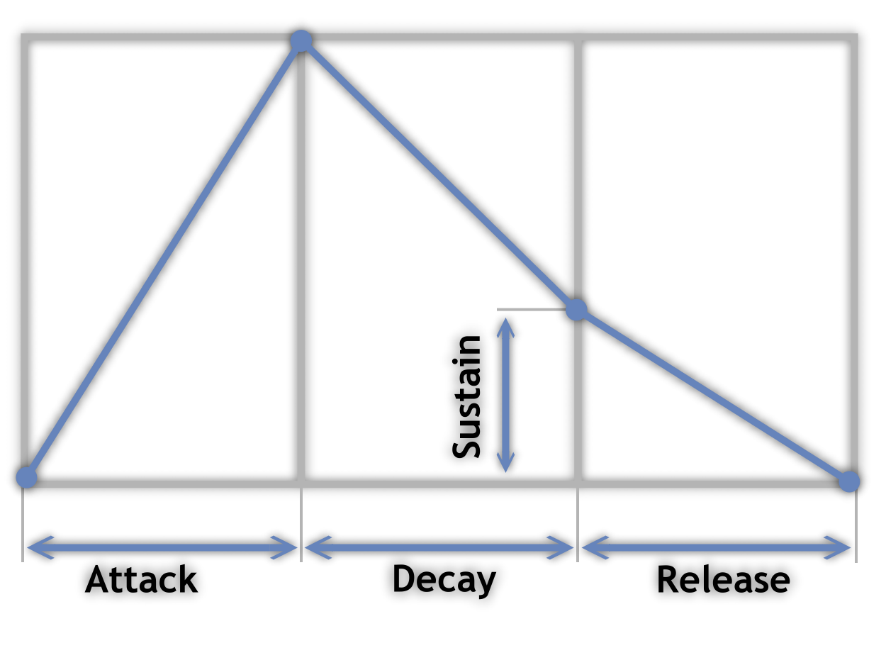
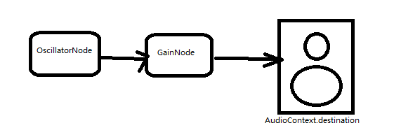
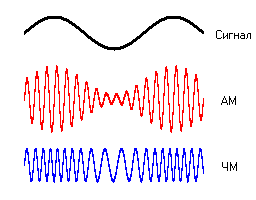
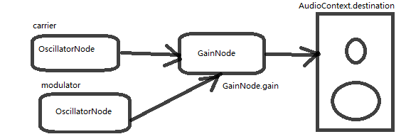

# FM-синтез звука в браузере

Рассмотрим возможности браузеров по синтезу звука.
Разберём основы и в качестве практического применения сделаем эмулятор Yamaha DX7.

## Web Audio API

Браузеры позволяют вызывать из JavaScript объекты для управления и создания звука.
Документация на русском: https://developer.mozilla.org/ru/docs/Web/API/Web_Audio_API

API предоставляет компоненты для создания и изменения звуков. Причём сами компоненты можно соединять между собой, а их свойства менять по расписанию.

## Hello World!

Рассмотрим простейший пример, нечто вроде Hello World!
Код примера страницы HTML с комментариями:

```html
<html>
	<button onclick='start();'>beep</button> <!-- создаём на странице кнопку-->
	<script>
		function start() {
			let audioContext = new AudioContext();//создаём главный объект
			let when = audioContext.currentTime + 0.1;//время через 0.1с
			let beep = audioContext.createOscillator();//осциллятор это объект который делает "Пи-и-и-и"
			beep.frequency.value = 440;//частота ноты Ля
			beep.connect(audioContext.destination);//направляем звук в аудиовыход
			beep.start(when);//проигрываем в указанное время
			beep.stop(when + 1);//останавливаем через 1 секунду
		}
	</script>
</html>
```

запускаем в браузере https://mzxbox.ru/fmsynth/beep.html и наслаждаемся бибиканием.

## Огибающая звуков

Если дёрнуть струну гитары или нажать клавишу пианино, можно заметить что естественный звук отличается от компьютерного.
Клавиша звучит громче в момент нажатия и постепенно угасает со временем.
В синтезеторах этот эффект достигается регулированием ADSR-огибающей:



Описание https://ru.wikipedia.org/wiki/ADSR-огибающая

Расширим наш прошлый пример:



```html
<html>
	<button onclick='start();'>beep AHDSR</button>
	<script>
		function start() {
			let audioContext = new AudioContext();//создаём главный объект
			let when = audioContext.currentTime + 0.1;//играть через 0.1с после нажатия кнопки
			let beep = audioContext.createOscillator();//осциллятор это объект который делает "Пи-и-и-и"
			beep.frequency.value = 440;//частота ноты Ля
			let envelope = audioContext.createGain();//объект Gain это громкость
			envelope.gain.setValueAtTime(0, when);//в начале звучания громкость 0
			envelope.gain.linearRampToValueAtTime(1, when + 0.05);//постепенно увеличить до 1 за 0.5с
			envelope.gain.linearRampToValueAtTime(0.5, when + 0.2);//понизить до 0.5 за 0.2с
			envelope.gain.setValueAtTime(0.5, when + 0.99);//это нужно для правильно расчёта
			envelope.gain.linearRampToValueAtTime(0, when + 1);//в конце звука понизить до 0
			envelope.connect(audioContext.destination);//"громкость" направляем в аудиовыход
			beep.connect(envelope);//осциллятор направляем в "громкость"
			beep.start(when);
			beep.stop(when + 1);
		}
	</script>
</html>
```

запускаем в браузере https://mzxbox.ru/fmsynth/envelope.html - звук без резких скачков, более громкий в начале и тихий в конце.

## Амплитудно-частотная модуляция

В модуляции звука сигнал-носитель (carrier) изменяется с помощью сигнала-изменятеля (modulator).

Амплитудная модуляция - вид модуляции, при которой изменяемым параметром несущего сигнала является его амплитуда.

Частотная модуляция - вид аналоговой модуляции, при которой модулирующий сигнал управляет частотой несущего колебания. По сравнению с амплитудной модуляцией здесь амплитуда остаётся постоянной.



### Амплитуданя модуляция

Звук из модулятора направляется в свойство gain (громкость) узля Gain на вход которого подключен носитель:



Код примера:

```html
<html>
	<button onclick='start();'>Amplitude modulation</button>
	<script>
		function start() {
			let audioContext = new AudioContext();
			let when = audioContext.currentTime + 0.1;
			let carrier = audioContext.createOscillator();
			let modulator = audioContext.createOscillator();
			let level = audioContext.createGain();
			carrier.frequency.value = 440;
			modulator.frequency.value = 8;
			carrier.connect(level);
			level.connect(audioContext.destination);
			modulator.connect(level.gain);
			carrier.start(when);
			modulator.start(when);
			carrier.stop(when + 1);
			modulator.stop(when + 1);
		}
	</script>
</html>
```

прослушать в браузере https://mzxbox.ru/fmsynth/amplitude.html 

### Частотная модуляция

```html
<html>
	<button onclick='start();'>frequency modulation</button>
	<script>
		function start() {
			let audioContext = new AudioContext();
			let when = audioContext.currentTime + 0.1;
			let carrier = audioContext.createOscillator();
			let modulator = audioContext.createOscillator();
			let level = audioContext.createGain();
			let shift = audioContext.createConstantSource();
			modulator.frequency.value = 4;
			level.gain.value=500;
			shift.offset.value = 1;
			carrier.connect(audioContext.destination);
			level.connect(carrier.frequency);
			modulator.connect(level);
			shift.connect(level);
			carrier.start(when);
			modulator.start(when);
			shift.start(when);
			carrier.stop(when + 1);
			modulator.stop(when + 1);
			shift.stop(when + 1);
		}
	</script>
</html>
```
